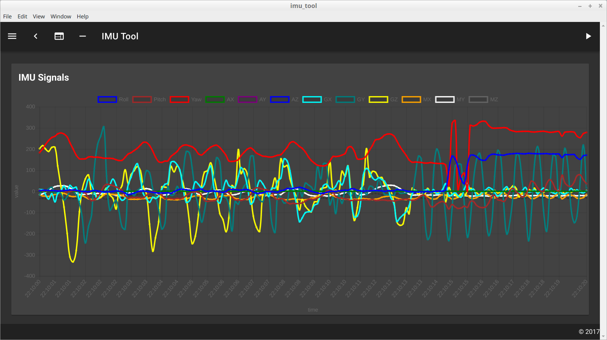
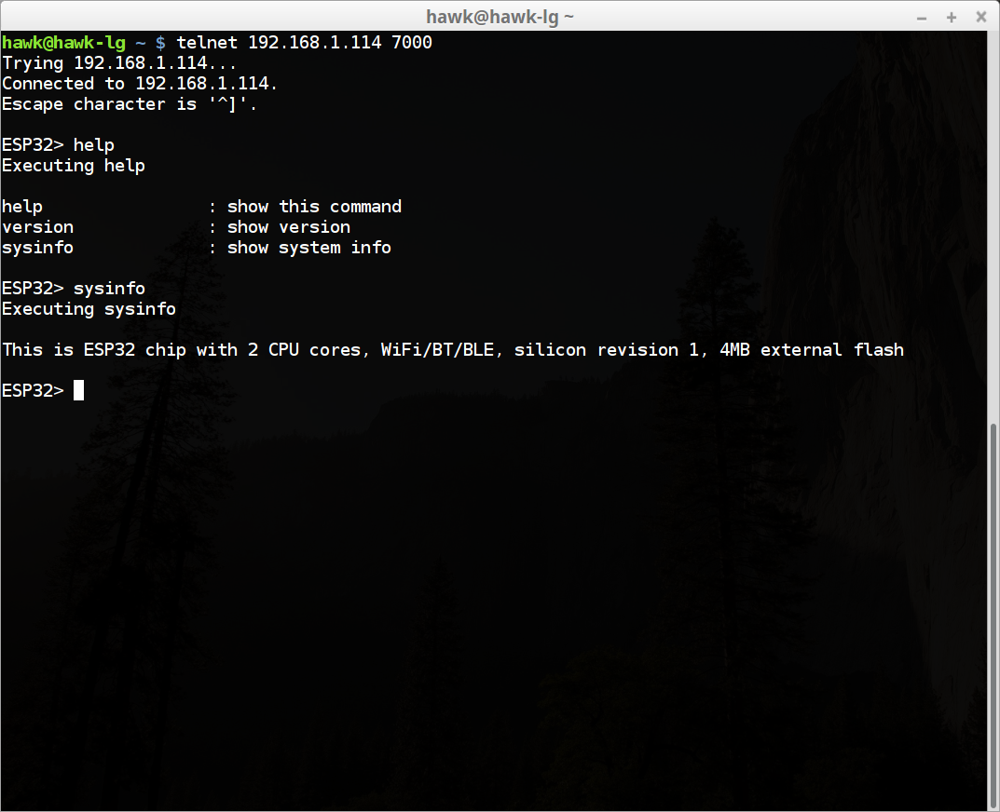

# ESP32 IMU

9-DOF IMU using ESP32 and MPU9250

## current status

### IMU tool (May/29/2018)
One picture is worth a thousand words!

### as of May,13,2018
CLI is implemented. Now you can access ESP32 via telnet.

By the way, the code might seem a bit intimidating at first.
But that is how I think networking code should be written. Everything should be an event
using an simple event loop. Otherwise you wouldn't be able to handle the complications and the concurrency in the end. Just my 10 cents on it!

### as of May,12,2018
just getting started, folks!

## Pins

| Purpose    | Pin #  |
| ---------- | ------ |
| Green LED  | 22     |

## Schematic

Check [this](doc/T10_V1.2.pdf) out

## Boot Process

To develop a firm understanding on what's going on behind the scenes, I always care about system startup process.
Actually this is well explained [here](https://esp-idf.readthedocs.io/en/v2.0/general-notes.html)

To sum it up,
1. ROM bootloader loads second-stage bootloader in SPI Flash to RAM from flash offset 0x1000
   * Second-stage bootloader source is available at components/bootloader directory of ESP-IDF.
   * Partition table is at 0x8000 of SPI flash.
   * It is interesting to note that second-stage bootloader initializes MMU!
   * Also it is interesting to note that SPI flash memory is memory mapped by MMU and can be read via normal memory read.

2. Second-stage bootloader loads partition table and main application image

3. main app executes

Application Memory Layout. The chip itself is not that simple.
ESP32 comes with 520 KiB SRAM. Most boards I know have 4 MB SPI flash.

| Type        | Note                                                                 |
| ----------- | -------------------------------------------------------------------- |
| IRAM        | instruction RAM. a part of internal SRAM0. fast execution & for ISRs |
| IROM        | instruction ROM. SPI flash.                                          |
| RTC fasl    | for code that has to run after wake-up from deep sleep.              |
| DRAM        | data ram. of course.                                                 |
| DROM        | read only data in SPI flash.                                         |
| RTC slow    | blah blah blah                                                       |

## 1.44 LCD
According to the shcematic, ST7735 TFT is connected to ESP32 using S/W SPI.
Pretty bad not to use H/W SPI and DMA for LCD interface.

| Name       | Pin #  |
| ---------- | ------ |
| MOSI       | 23     |
| SCK        | 5      |
| CS         | 16     |
| MOSI       | 23     |
| CMD/DATA   | 17     |
| RESET      | N/A    |

One more thing to note is there is no pin to control LCD backlight with.
It can be quite annoying.

## Debugger Setup

1. get openocd
  * [well explained here](http://esp-idf.readthedocs.io/en/latest/api-guides/jtag-debugging/#jtag-debugging-setup-openocd)
  * [download esp32 openocd](http://esp-idf.readthedocs.io/en/latest/api-guides/jtag-debugging/setup-openocd-linux.html)

2. FTDI Connection as shown below

  | FT2232HL     |  ESP32     | Purpose    |
  | ------------ | ---------- | ---------- |
  |ADBUS0        | 13         | TCK        |
  |ADBUS1        | 12         | TDI        |
  |ADBUS2        | 15         | TDO        |
  |ADBUS3        | 14         | TMS        |
  |GND           | GND        | GND        |
  |VIO           | 3V3        | 3V3        |

  Problem is pin 12/13/14/15 are used for SDIO, which means
  * you can't use JTAG interface while using Micro-SD slot
  * we need a some special SDIO adapter to connect FT2232H and ESP32

  And finally found a wonderful sdio adapter.
  
  Check it out at [Aliexpress](https://www.aliexpress.com/item/kebidu-Hot-sale-25CM-48CM-62CM-TF-to-micro-SD-card-Flex-Extension-cable-Extender-Adapter/32832944156.html?spm=2114.10010108.1000013.1.27bc4b3b74DRpO&scm=1007.13339.90158.0&scm_id=1007.13339.90158.0&scm-url=1007.13339.90158.0&pvid=2645295a-4392-4172-896b-e88ce2aafd8f&_t=pvid:2645295a-4392-4172-896b-e88ce2aafd8f,scm-url:1007.13339.90158.0)

  I will defer this debugging setup till the adapter arrives!

## esptool.py
### to read parition table
esptoo.py read_flash 0x8000 0xc00 partition.img

### to backup the entire flash
esptool.py read_flash 0x0000 0x400000 backup.img

### to read the MAC address
esptool.py read_mac 

### to reset
esptool.py run

### to write to flash
esptoo.py write_flash address your-bin

### built-in partition table
partition table is at 0x8000 with size 0xc00

### to convert binary partition table to csv
gen_esp32part.py --verify binary_partitions.bin input_partitions.csv

### to convert csv to partition table
gen_esp32part.py --verify input_partitions.csv binary_partitions.bin

### default esp32 partition table
  Espressif ESP32 Partition Table

  |Name      |Type    |SubType    |Offset     |Size      |
  | -------- | ------ | --------- | --------- | -------- |
  | nvs      | data   | nvs       | 0x9000    | 0x6000   |
  | phy_init | data   | phy       | 0xf000    | 0x1000   |
  | factory  | app    | factory   | 0x10000   | 1M       |
